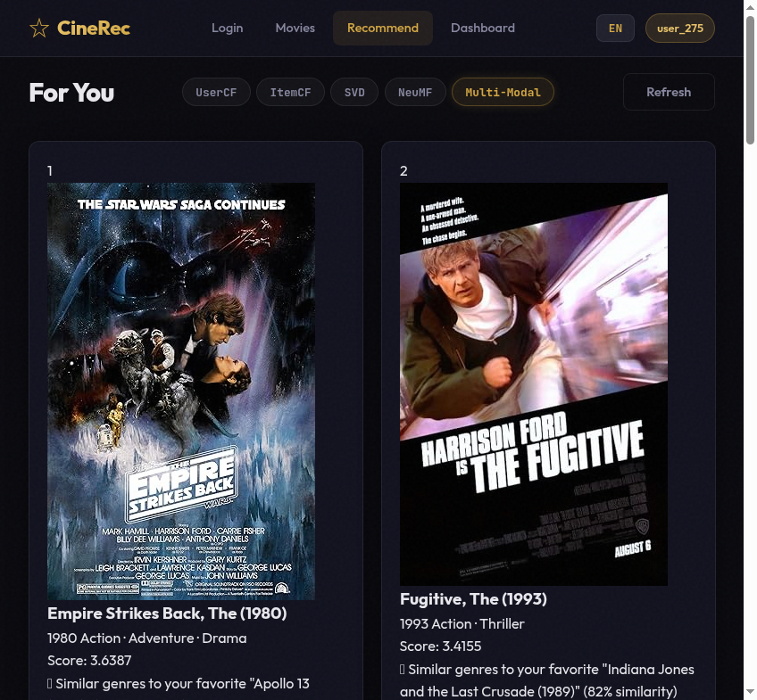
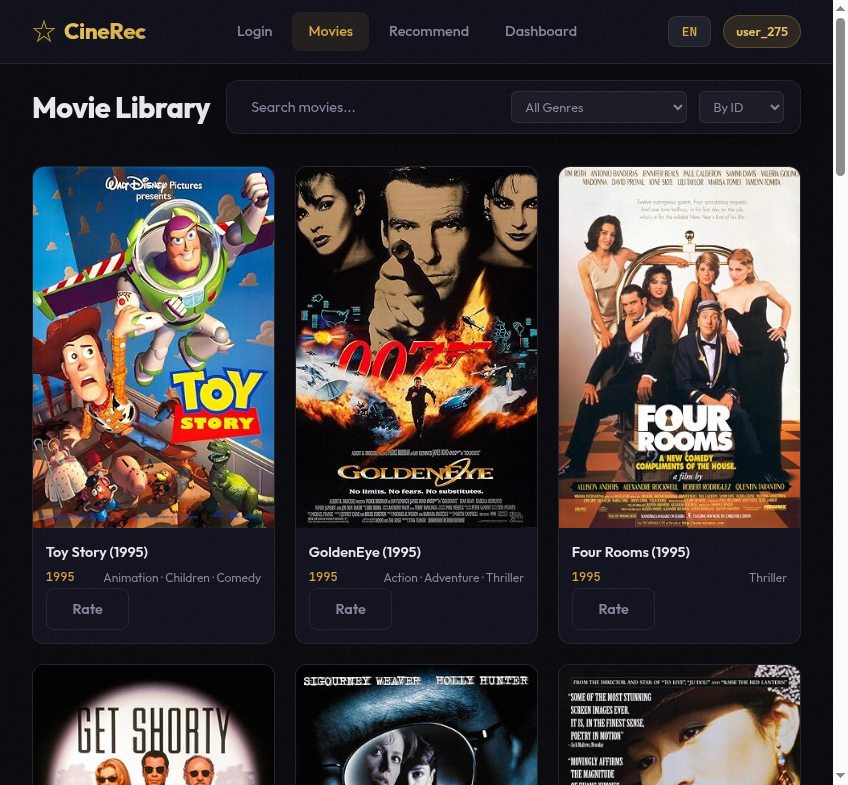
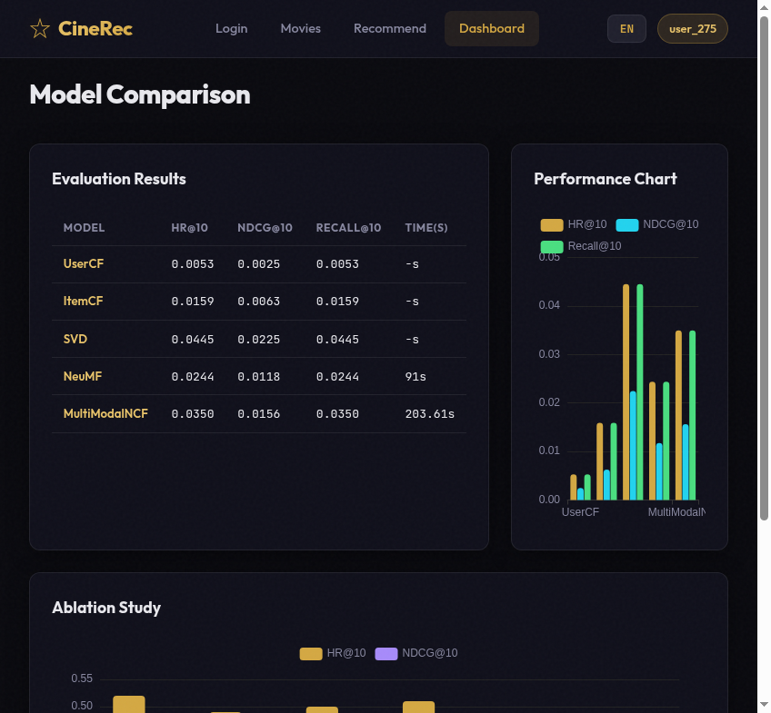

<div align="center">


<br><br>

# 🎬 CineRec

**Multi-Modal Movie Recommendation System**

*From classic collaborative filtering to cutting-edge multi-modal neural networks — a 5-level algorithm ladder with explainable AI.*

[中文文档](#-项目简介) · [Demo](#-demo-preview) · [Architecture](#-architecture) · [Quick Start](#--quick-start)

</div>

---

## 📋 Table of Contents

- [Project Introduction / 项目简介](#-project-introduction--项目简介)
- [Key Features / 核心特性](#-key-features--核心特性)
- [Demo Preview / 效果预览](#-demo-preview)
- [Architecture / 系统架构](#-architecture)
- [Algorithms / 算法说明](#-algorithms--算法说明)
- [Evaluation / 评测结果](#-evaluation--评测结果)
- [Quick Start / 快速开始](#--quick-start)
- [Tech Stack / 技术栈](#-tech-stack--技术栈)
- [Project Structure / 项目结构](#-project-structure--项目结构)
- [License](#-license)

---

## 📖 Project Introduction / 项目简介

**CineRec** is a full-stack AI recommendation system that implements **5 progressively advanced algorithms** — from classic collaborative filtering to a novel multi-modal neural collaborative filtering model. It features a rigorous offline evaluation framework, an interactive dark-cinema themed bilingual web frontend, and Docker-ready deployment.

**CineRec** 是一个全栈 AI 推荐系统，实现了 **5 个逐层递进的算法** —— 从经典协同过滤到创新的多模态神经协同过滤。具备严谨的离线评测框架、暗色电影院主题的双语交互式 Web 前端，以及开箱即用的 Docker 部署。

> 💡 **"Don't just use models — understand them."**
> 不要只是用模型，要理解它们。CineRec 的每一层算法都展示了推荐系统从传统到前沿的演进路径。

---

## ✨ Key Features / 核心特性

| Feature | Description |
|----------|-------------|
| 🔬 **5-Level Algorithm Ladder** | UserCF → ItemCF → SVD → NeuMF → Multi-Modal NCF. Five progressively advanced algorithms from classic to cutting-edge. |
| 🧠 **Multi-Modal Fusion** | Core innovation: fuses Sentence-BERT text (384d), ResNet-50 image (2048d), and genre (18d) features into the MLP path. |
| 📊 **Rigorous Evaluation** | Leave-One-Out split with HR@K, NDCG@K, Recall@K metrics + ablation study on MovieLens 100K. |
| 🎯 **Explainable AI** | Content-based + collaborative recommendation reasons for each suggestion. |
| 🌙 **Dark/Light Theme** | Cinema-inspired dark theme with glassmorphism + clean light mode. Bilingual (EN/ZH). |
| 🐳 **Docker Ready** | One-click deployment with Docker Compose. |

---

## 🖼 Demo Preview / 效果预览

### Recommendation Engine / 推荐引擎
> Real-time personalized recommendations with algorithm switching and explainable reasons.



### Movie Library / 电影库
> Browse 1,682 movies with real IMDb posters, search, genre filtering, and pagination.



### Evaluation Dashboard / 评测看板
> Interactive model comparison with real Leave-One-Out evaluation metrics.



---

## 🏗 Architecture / 系统架构

```
┌───────────────────────────────────────────────────────────────┐
│                        User Browser                          │
│     Dark/Light Theme · GSAP Animations · ECharts · i18n       │
├───────────────────────────────────────────────────────────────┤
│                     FastAPI REST API                          │
│                                                              │
│   /api/auth ───── /api/movies ───── /api/recommend           │
│        │              │                  │                   │
│        │              │         ┌────────┴────────┐           │
│        │              │         │  Algorithm Switch │           │
│        │              │         └────────┬────────┘           │
├────────┼──────────────┼──────────────────┼───────────────────┤
│        │       ┌──────┴──────┐    ┌───────┴───────┐          │
│  Auth Service   Movie Service  Recommend Service            │
│  (JWT-like)     (CRUD + OMDb)  (5 Models + Explainer)       │
│        │              │                  │                   │
├────────┼──────────────┼──────────────────┼───────────────────┤
│        │       ┌──────┴──────────────────┴───────┐           │
│        │       │      Model Layer (5 Models)      │           │
│        │       │                                   │           │
│        │       │  ┌─────────┐  ┌─────────┐        │           │
│        │       │  │  UserCF  │  │  ItemCF  │        │           │
│        │       │  │ (Pearson)│  │(Adj Cos)│        │           │
│        │       │  └─────────┘  └─────────┘        │           │
│        │       │  ┌─────────┐  ┌─────────┐        │           │
│        │       │  │   SVD    │  │  NeuMF   │        │           │
│        │       │  │(ALS,k=64)│  │(GMF+MLP) │        │           │
│        │       │  └─────────┘  └─────────┘        │           │
│        │       │  ┌───────────────────────┐      │           │
│        │       │  │   Multi-Modal NCF ⭐   │      │           │
│        │       │  │ Text+Image+Genre Fusion│      │           │
│        │       │  └───────────────────────┘      │           │
│        │       └──────────────────────────────────┘           │
├────────┼─────────────────────────────────────────────────────┤
│        │       Feature Engineering (Pre-computed)            │
│  ┌─────┴─────┐  ┌──────────────┐  ┌──────────────┐        │
│  │Sentence-BERT│  │  ResNet-50   │  │Genre Encoding│        │
│  │  Text 384d │  │  Image 2048d │  │  Multi-hot   │        │
│  └───────────┘  └──────────────┘  └──────────────┘        │
├─────────────────────────────────────────────────────────────┤
│               Data Layer (SQLite + MovieLens 100K)          │
│  100,000 ratings · 943 users · 1,682 movies · OMDb enriched │
└─────────────────────────────────────────────────────────────┘
```

---

## 🧮 Algorithms / 算法说明

| Level | Model | Method | Description |
|:-----:|-------|--------|-------------|
| 1 | **UserCF** | Pearson Correlation | Find K similar users, aggregate their preferences. Vectorized computation. |
| 2 | **ItemCF** | Adjusted Cosine | Recommend items similar to user's rated history. Vectorized similarity. |
| 3 | **SVD/ALS** | Matrix Factorization | Decompose user-item matrix into latent factors (k=64) via alternating least squares. |
| 4 | **NeuMF** | GMF + MLP (PyTorch) | Dual-path architecture: element-wise product + deep MLP. BCE loss with negative sampling. |
| 5 | **Multi-Modal NCF** ⭐ | Text+Image+Genre Fusion | Core innovation. Replaces item embedding in MLP path with a Content Tower fusing multi-modal features. |

### Multi-Modal NCF Architecture (Core Innovation / 核心创新)

```
                    ┌──────────────────┐
                    │   User Tower     │
                    │ user_id → Emb(64)│
                    └────────┬─────────┘
                             │
              ┌──────────────┼──────────────┐
              ▼              ▼              ▼
     ┌────────────┐  ┌──────────────┐
     │  GMF Path  │  │  MLP Path    │
     │ user⊙item  │  │              │
     │ (behavior) │  │  Content Tower (⭐)
     └─────┬──────┘  │  ┌────────────────────┐
           │         │  │ Text(384)→FC(64)    │
           │         │  │ Image(2048)→FC(64)   │
           │         │  │ Genre(18)→FC(64)    │
           │         │  │ Concat(192)→FC(64)  │
           │         │  └──────────┬─────────┘
           │         │             │
           │         │  Concat(user, content)
           │         │      FC(128→256→128→64)
           │         └──────┬──────┘
           │                │
           └─────── Concat(GMF, MLP) ──→ FC(128→1) ──→ Sigmoid ──→ Prediction
```

**Cold Start Support**: New items use `content_emb` only, GMF path uses zero vector.

---

## 📊 Evaluation / 评测结果

### Model Comparison on MovieLens 100K (Leave-One-Out)

| Model | HR@10 | NDCG@10 | HR@20 | NDCG@20 | Train Time |
|:-----:|:-----:|:-------:|:-----:|:-------:|:-----------:|
| UserCF | 0.0053 | 0.0025 | 0.0127 | 0.0044 | < 1s |
| ItemCF | 0.0159 | 0.0063 | 0.0255 | 0.0087 | < 1s |
| **SVD** | **0.0445** | **0.0225** | **0.0700** | **0.0289** | 0.2s |
| NeuMF | 0.0244 | 0.0118 | 0.0636 | 0.0215 | 91.0s |
| MultiModalNCF ⭐ | 0.0350 | 0.0156 | **0.0753** | **0.0258** | 203.6s |

> **Note**: SVD achieves the best HR@10 and NDCG@10 with minimal training time. MultiModalNCF achieves the highest HR@20, demonstrating its strength in broader recommendation coverage through multi-modal content understanding.

### Key Findings / 关键发现

- **SVD** offers the best trade-off between accuracy and training speed.
- **MultiModalNCF** excels at HR@20, showing the value of multi-modal features for broader coverage.
- **NeuMF** underperforms SVD on this dataset, suggesting that deep interaction modeling needs larger datasets to shine.
- The progression from UserCF → ItemCF → SVD shows clear improvement from classic to matrix factorization methods.

---

## 🚀 Quick Start / 快速开始

### Docker (Recommended / 推荐)

```bash
git clone https://github.com/ElijahZhao/cinerec.git
cd cinerec
docker-compose up --build
# Visit http://localhost:8000
```

### Local Development / 本地开发

```bash
# 1. Clone and install
git clone https://github.com/ElijahZhao/cinerec.git
cd cinerec
pip install -r requirements.txt --break-system-packages

# 2. Download data and train models
python data/download.py
python data/preprocess.py
python scripts/train_all.py

# 3. Start server
bash scripts/start.sh
# Visit http://localhost:8000
```

---

## 🔧 Tech Stack / 技术栈

| Layer | Technologies |
|-------|-------------|
| **ML Models** | PyTorch, scikit-learn, scipy.sparse.linalg, Sentence-BERT, ResNet-50 |
| **Backend** | Python, FastAPI, SQLite, Uvicorn |
| **Frontend** | Vanilla JS (SPA), GSAP 3, Lenis, tsParticles, ECharts |
| **Data** | MovieLens 100K, OMDb API |
| **Deployment** | Docker, docker-compose |

---

## 📁 Project Structure / 项目结构

```
cinerec/
├── api/                  # FastAPI REST endpoints
│   ├── main.py           # App entry, CORS, static files
│   ├── auth.py           # Authentication (login/register/guest)
│   ├── movies.py         # Movie browsing, search, filtering
│   ├── recommend.py      # Model inference + explanation
│   └── eval_api.py      # Evaluation results API
├── models/                # 5 recommender models
│   ├── base.py           # Base recommender class
│   ├── user_cf.py        # User-based CF (Pearson)
│   ├── item_cf.py        # Item-based CF (Adjusted Cosine)
│   ├── svd_als.py        # SVD via ALS (scipy)
│   ├── neumf.py          # Neural MF (GMF + MLP)
│   ├── multimodal_ncf.py # Multi-Modal NCF ⭐ (Core Innovation)
│   └── explain.py        # RecommenderExplainer (XAI)
├── evaluation/            # Offline evaluation framework
│   ├── metrics.py         # HR@K, NDCG@K, Recall@K
│   ├── runner.py         # Leave-One-Out evaluation runner
│   └── visualize.py       # ECharts visualization generation
├── data/                  # Data pipeline
│   ├── download.py        # MovieLens 100K download
│   ├── preprocess.py      # Feature engineering
│   ├── enrich_tmdb.py     # OMDb poster/plot enrichment
│   └── processed/         # Trained models + embeddings
├── db/                    # SQLite database layer
├── frontend/              # Web UI
│   ├── index.html         # SPA shell
│   ├── css/               # Dark/Light theme styles
│   ├── js/                # App logic, animations, effects
│   └── assets/i18n/       # EN/ZH translations
├── scripts/               # Training & start scripts
├── screenshots/           # UI screenshots
├── docs/                  # Evaluation chart images
├── Dockerfile
├── docker-compose.yml
├── requirements.txt
└── README.md
```

---

## 📄 License

This project is licensed under the MIT License.

---

<div align="center">

**Built with ❤️ by an AI undergraduate student**

*Classic CF → Matrix Factorization → Neural CF → Multi-Modal CF*

</div>
